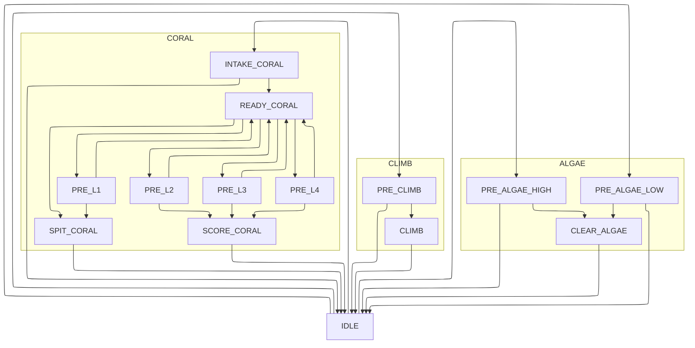

# Superstructure Graph

## Descriptions

| State | Description | End |
| ----- | ----------- | --- |
| IDLE  | The robot has no game pieces, the elevator and climber is stowed, and the intake is not running.| An intake or climb request is triggered. |
| INTAKE_CORAL | The robot is ready to intake a coral, the elevator is at the correct position and the intake is running.| A stow request or game piece is detected. |
| READY_CORAL | The robot has a coral in the intake. The elevator is retracted. | A scoring, prescoring, or spit request is triggered. |
| SPIT_CORAL | The robot ejects a coral from the intake onto the ground. | No game piece is detected. |
| PRE_{L1-4} | Move the elevator to the corresponding position in preparation for scoring. | The elevator is in the correct position and the score request is triggered. |
| SCORE_CORAL | The robot holds the elevator in it's position and ejects a held coral. | No coral is detected in the robot. |
| PRE\_ALGAE_{Location} | The robot moves the elevator to the relevant position and runs the intake to intake algae. | When the request ends. |
| CLEAR_ALGAE | The robot holds the elevator in it's position and runs the intake rollers. | The corresponding request ends. |
| PRE_CLIMB | The robot extends the climber and runs any motion required to latch onto the cage. | When the robot grabs the cage and a relevant request is triggered. |
| CLIMB | The robot pivots the climber back up. | A relevant cancel request is run, although this may be dangerous if the robot is hanging. |
